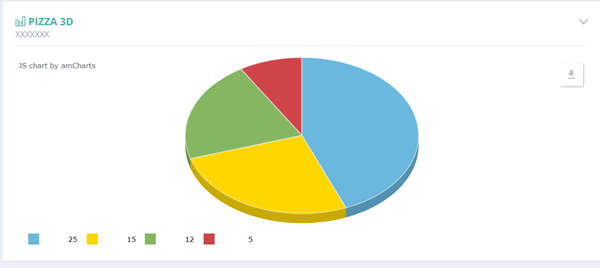
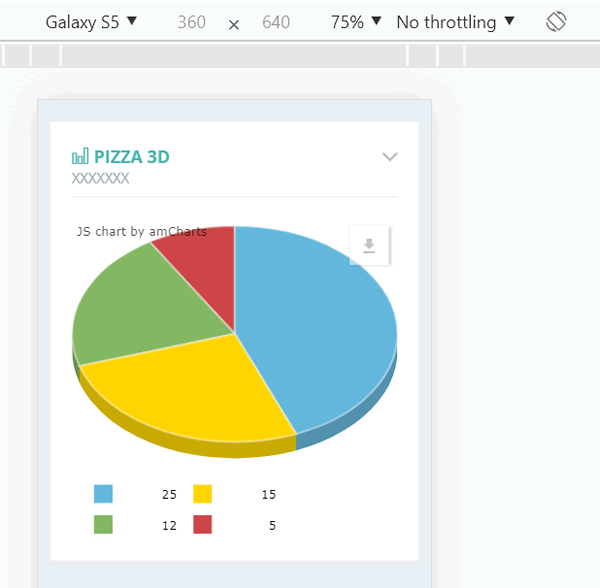

# AMCHARTS - Gráficos

Este repositório tem exemplos de gráficos feitos com a biblioteca AMCHARTS.

Os gráficos são responsivos. A página de exemplo utiliza Bootstrap. Todos os exemplos tem a opção de exportar dados.

Gráficos disponíveis:

- Pizza
- Barra Horizontal
- Pizza 3D
- Linhas com mais de 1 indicador
- Colunas
- Colunas Agrupadas
- Polar (Radar)

